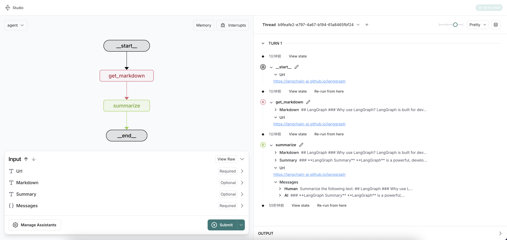

# Agent Demo

A Python-based agent demo that utilizes LangGraph and LangSmith to create and monitor agents.

## Features

- Agent that can use tools to retrieve and convert web content into a markdown text.
- Uses LangSmith for tracking and monitoring agent runs.

## Installation

1. Clone the repository:

```bash
git clone https://github.com/jeremy-feng/agent-demo.git
cd agent-demo
python setup.py develop
```

3. Set up environment variables:

Create a `.env` file in the project root with several environment variables:

```
OPENAI_API_BASE=XX
OPENAI_API_KEY=XX
LANGSMITH_API_KEY=XX
```

## Tracking and Monitoring

The agent uses LangSmith for tracking and monitoring agent runs. You can view the runs in the LangSmith UI.

```bash
langgraph dev 
```

This will start up the LangGraph API server locally. If this runs successfully, you should see the LangGraph Studio Web UI running at `https://smith.langchain.com/studio/?baseUrl=http://127.0.0.1:2024`.



## Usage

Here's a simple example of how to use the agent:

```python
from agent_demo import make_summarize_web_agent

# Create the agent
agent = make_summarize_web_agent()

# Run the agent with a URL
result = agent.invoke({"url": "https://langchain-ai.github.io/langgraph"})

# Get the summary
print(result["summary"])
```

For more detailed examples, check out the `examples` directory in the repository.

## License

This project is licensed under the MIT License - see the [LICENSE](LICENSE) file for details.
